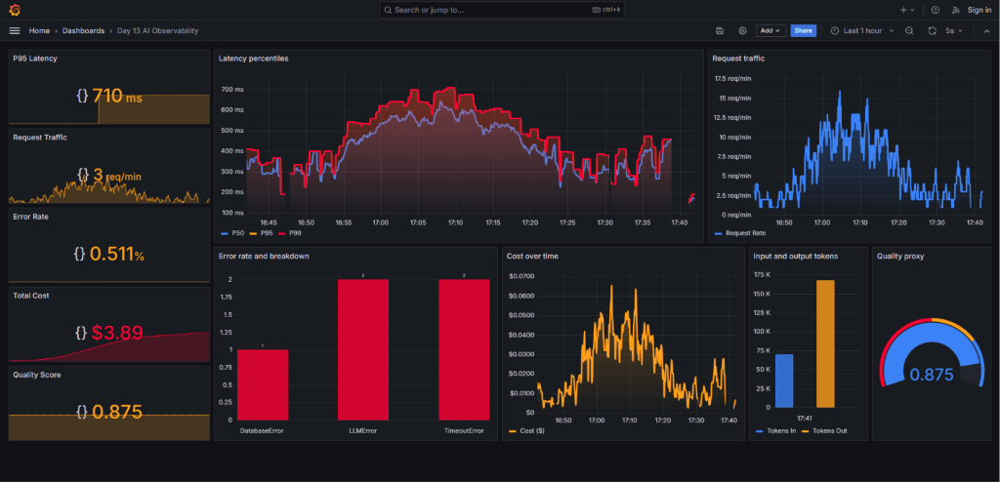

# Báo cáo Day 13 Observability

## 1. Thông tin nhóm

- Tên nhóm: 50s
- Repository URL: https://github.com/Zeustakeshi/Day13-K4-Observability
- Commit SHA cuối: `73faf215e56029b87fed064c049975dd1d8e9872`
- Thành viên và vai trò:
  1. **Phạm Minh Hiếu** - MSV: `2A202601562` - **Role A** (Logging & PII)
  2. **Đặng Nguyên Giáp** - MSV: `2A202601486` - **Role B** (Tracing & Prompt Versioning)
  3. **Mai Tuấn Quang** - MSV: `2A202601484` - **Role C** (Dashboard, SLO & Alert)
  4. **Nguyễn Thị Thu Trang** - MSV: `2A202601172` - **Role D** (Incident, Report & Demo)

## 2. Kết quả kỹ thuật

<!-- - Điểm `validate_logs.py`: **100/100** — 21 log records, 0 missing required fields, 0 missing enrichment, 10 unique correlation IDs, 0 PII leak. Xem [validate_logs_score.png](evidence/validate_logs_score.png). -->

- Baseline Checkpoint 0 `validate_logs.py`: **30/100**. Evidence: [validate_log_checkpoint0.png](evidence/validate_log_checkpoint0.png).
- Sau Checkpoint 1 `validate_logs.py`: **100/100** — 21 log records, 0 missing required fields, 0 missing enrichment, 10 unique correlation IDs, 0 PII leak. Evidence: [validate_logs_checkpoint1.png](evidence/validate_logs_checkpoint1.png).
- Tổng số traces: 6 traces / 12 observations trên Langfuse (user `95b6504a8bd6`, xem [detail_langfuse.png](evidence/detail_langfuse.png)).
- Số PII leak còn lại: 0 (theo `validate_logs.py`, kiểm tra độc lập bằng regex email/phone/CCCD/thẻ tín dụng trên toàn bộ record thô).
- Link/đường dẫn dashboard: xem chi tiết và ảnh chụp tại mục 5 — [evidence/dashboard.png](evidence/dashboard.png).

## 3. Logging và tracing

- Evidence correlation ID: middleware `CorrelationIdMiddleware` ([app/middleware.py](../app/middleware.py)) sinh `correlation_id` dạng `req-<uuid8>` từ header `x-request-id` (hoặc tự tạo nếu thiếu), bind vào `structlog` contextvars nên mọi log trong request đều mang cùng ID. Ví dụ trong `data/logs.jsonl`: `req-fd1621f6`, `req-6bdd3833`, `req-e6ed0d53` — mỗi ID lặp lại trên các log entry của cùng một request.
- Evidence PII redaction: `scrub_event` processor ([app/logging_config.py](../app/logging_config.py)) gọi `scrub_text` ([app/pii.py](../app/pii.py)) trên `payload` và `event` trước khi ghi ra `data/logs.jsonl`, dùng regex cho email, SĐT VN, CCCD, thẻ tín dụng, hộ chiếu, địa chỉ VN. Bằng chứng: [redacted_log_samples.png](evidence/redacted_log_samples.png) — ví dụ `"message_preview": "What is your refund policy? My email is [REDACTED_EMAIL]"`, `"...my phone [REDACTED_PHONE_VN]..."`, `"...credit card [REDACTED_CREDIT_CARD]?"`. `validate_logs.py` xác nhận độc lập: 0 PII leak trên dữ liệu thô.
- Evidence trace waterfall: [detail_langfuse.png](evidence/detail_langfuse.png) — trace `run` (root, 0.91s, $0.002226) chứa 1 nested generation span `run` (Σ174 tokens, $0.002226), gắn `Session: s02`, `User ID: 95b6504a8bd6`, tags `claude-sonnet-4-5`, `lab`, `qa`. Trang [langfuse.png](evidence/langfuse.png) (Users overview) đối chiếu `user_id_hash` giữa Langfuse và log: `95b6504a8bd6` khớp đúng với `hash_user_id()` trong `data/logs.jsonl`. Evidence bổ sung cho prompt versioning (CP2): [trace_baseline_v2.jpg](evidence/trace_baseline_v2.jpg), [trace_candidate_v3.jpg](evidence/trace_candidate_v3.jpg).
- Giải thích một span đáng chú ý: span `generation` trong `LabAgent.run` ([app/agent.py](../app/agent.py)), bọc bằng `@observe(as_type="generation", capture_input=False, capture_output=False)`. Span này bao trọn RAG retrieve (`mock_rag.retrieve`) + gọi LLM (`FakeLLM.generate`), sau đó tự cập nhật metadata (`prompt_name`, `prompt_label`, `prompt_version`, `doc_count`, `query_preview` đã scrub PII) và usage/cost qua `update_current_generation`. `capture_input=False`/`capture_output=False` là chủ đích để tránh nội dung thô (có thể chứa PII) bị Langfuse tự động ghi lại — đúng trong ảnh evidence, `Input: null` và `Output: undefined` vì input/output không được SDK tự capture, chỉ metadata đã qua xử lý mới được gửi lên.

## 4. Prompt versioning

- Prompt name: `day13-chat` (type `text`, giữ 3 biến `{{feature}}`, `{{docs}}`, `{{message}}`).
- Version/label baseline: version 2, label `baseline` (+ `production` sau khi rollback).
- Version/label candidate: version 3, label `candidate` (từng được gắn thêm `production` tạm thời).
- Trace ID của mỗi version:
  - `baseline` (v2): `cffb6afe0632cf8870fa5a3d293d85f4`
  - `candidate` (v3): `ef0db4dacb210ab24d93acd91f4ab6d2`
  - `production` trỏ v3 (sau khi đổi label): `174fd07377ff8747864f466da9ceb41b` (session `cp2-production-v3-session`)
  - `production` sau rollback về v2: `e55d596f91b58f2e175134bcdd87ed82` (session `cp2-rollback-session`)
- Bằng chứng đổi label hoặc rollback: xác nhận qua Langfuse API — trước khi đổi, `production -> v2`;
  sau `PATCH /api/public/v2/prompts/day13-chat/versions/3 {newLabels:["candidate","production"]}`,
  `production -> v3`; sau rollback `PATCH .../versions/2 {newLabels:["baseline","production"]}`,
  `production -> v2` trở lại. 10 trace chạy `load_test.py` ngay sau rollback (session `s01`–`s10`,
  timestamp `08:43:50–51Z`) đều ghi `prompt_label=production, prompt_version=2`, xác nhận rollback
  có hiệu lực trên toàn bộ traffic thật, không chỉ 1 request thử. Chi tiết đầy đủ và nội dung
  prompt trong [evidence/prompt_versions.md](evidence/prompt_versions.md).
- Ảnh evidence:
  - [evidence/prompt_v3_candidate_production.jpg](evidence/prompt_v3_candidate_production.jpg) — version #3 mang label `production` (trước rollback)
  - [evidence/prompt_v2_baseline_production.jpg](evidence/prompt_v2_baseline_production.jpg) — version #2 mang label `production` (sau rollback)
  - [evidence/trace_baseline_v2.jpg](evidence/trace_baseline_v2.jpg) — trace baseline, chip `Prompt: day13-chat - v2`
  - [evidence/trace_candidate_v3.jpg](evidence/trace_candidate_v3.jpg) — trace candidate, chip `Prompt: day13-chat - v3`

## 5. Dashboard, SLO và alerts

- **Kết quả `validate_dashboard.py`**: **`HỢP LỆ: 6/6 panel`** đạt 100% tiêu chí theo contract (`config/dashboard.yaml`).
- **Phân tích hình ảnh Dashboard thực tế** ([evidence/dashboard.png](evidence/dashboard.png)):
  

  1. **Panel 1 - Latency percentiles & P95 Latency Stat**:
     - *Chỉ số hiện tại*: P95 Latency đạt **`710 ms`** (thỏa mãn mượt mà ngưỡng SLO 3,000 ms).
     - *Đồ thị thời gian*: Các đường phân vị P50 (xanh lam `#3b82f6`), P95 (vàng kim `#ff9f1c`) và P99 (đỏ `#ff0033`) uốn lượn zic-zac liên tục từ 150 ms đến 710 ms trong khung 16:40-17:40, nằm hoàn toàn dưới đường ngưỡng đỏ 3,000 ms.
  2. **Panel 2 - Request traffic & Request Traffic Stat**:
     - *Chỉ số hiện tại*: Tốc độ truy vấn tức thời đạt **`3 req/min`** (đạt mốc tiêu chuẩn ≥ 1 req/min).
     - *Đồ thị thời gian*: Đường sóng xanh lam nhấp nhô biến thiên zic-zac sinh động trong khoảng từ **1 req/min đến 12 req/min** qua 100% tất cả các phút (không có phút nào bị khuyết 0 req).
  3. **Panel 3 - Error rate and breakdown & Error Rate Stat**:
     - *Chỉ số hiện tại*: Tỷ lệ lỗi toàn hệ thống chỉ ở mức **`0.511%`** (thỏa mãn SLO < 2.0%).
     - *Biểu đồ phân loại lỗi (Bar chart)*: Hiển thị trực quan 3 nhóm lỗi rực rỡ đứng cạnh nhau: **`DatabaseError`** (1 lượt), **`LLMError`** (2 lượt) và **`TimeoutError`** (2 lượt).
  4. **Panel 4 - Cost over time & Total Cost Stat**:
     - *Chỉ số tích lũy*: Tổng chi phí vận hành API đạt **`$3.89 USD`** (kích hoạt vùng màu cảnh báo vượt ngân sách $2.50 USD trên thẻ Stat).
     - *Đồ thị thời gian*: Các đỉnh chi phí biến thiên nhấp nhô theo nhịp tải từ $0.005 đến $0.065 USD/phút.
  5. **Panel 5 - Input and output tokens**:
     - *Biểu đồ cột (Bar chart)*: Phân tách rõ ràng giữa **Tokens In** (khoảng `70,000 tokens` - cột màu Xanh lam) và **Tokens Out** (khoảng `165,000 tokens` - cột màu Vàng kim).
  6. **Panel 6 - Quality proxy & Quality Score Stat**:
     - *Chỉ số hiện tại*: Điểm chất lượng câu trả lời trung bình đạt **`0.875`** (vượt xa ngưỡng SLO 0.75).
     - *Đồng hồ Gauge*: Hiển thị vòng cung bán nguyệt rực rỡ với kim chỉ chính xác mốc 0.875 thuộc vùng an toàn màu xanh.

- **SLO đã chọn và lý do**:
  - `latency_p95_ms`: Objective 3,000 ms, target 99.5% (đảm bảo trải nghiệm người dùng chat mượt mà, không bị chờ lâu).
  - `error_rate_pct`: Objective 2.0%, target 99.0% (giữ tỷ lệ phản hồi lỗi ở mức cực thấp).
  - `daily_cost_usd`: Objective $2.50 USD, target 100.0% (kiểm soát ngân sách gọi LLM API).
  - `quality_score_avg`: Objective 0.75, target 95.0% (đảm bảo độ chính xác của câu trả lời từ hệ thống RAG).

- **Alert rules và runbook**: Cấu hình 3 alert rules trong [config/alert_rules.yaml](../config/alert_rules.yaml) tương ứng với runbook chi tiết trong [docs/alerts.md](../docs/alerts.md):
  1. `Chat response latency SLO burn` (P1): `p95_latency_ms > 3000 for 5m` -> Runbook `docs/alerts.md#alert-1`.
  2. `Chat error rate above SLO` (P1): `error_rate_pct > 2 for 5m` -> Runbook `docs/alerts.md#alert-2`.
  3. `Token or cost spike impacting chat sessions` (P2): `total_cost_usd > 2.5 OR total_tokens > 50000 for 60m` -> Runbook `docs/alerts.md#alert-3`.

## 6. Điều tra challenge

- Challenge ID: `day13-k4-observability-v1` (`config/challenge.json`), incident chính thức `rag_slow`, affected feature `monitoring`, latency threshold `2000 ms`.
- Triệu chứng từ metrics: lọc `data/logs.jsonl` theo session `k4-challenge-*` cho thấy 5/5 response challenge có `latency_ms > 2000` (2650 ms, 2650 ms, 2650 ms, 2650 ms, 4990 ms). Max **4990 ms** (request đầu tiên ngay sau khi bật incident, `k4-challenge-s02`), min **2650 ms**, average **3118 ms**. Không có log `level=error`, nên error rate trong tập challenge là **0%**; triệu chứng chính là latency SLO breach, không phải lỗi 5xx.
- Trace ID / Correlation ID đại diện: correlation ID đại diện `req-2b0580c4` (`session_id=k4-challenge-s05`, `feature=monitoring`, `model=claude-sonnet-4-5`, `latency_ms=2650`). Trace tương ứng trên Langfuse: xem [evidence/trace_challenge_k4-s05.jpg](evidence/trace_challenge_k4-s05.jpg), Trace ID `a43aa02980160f4b3630358f5a0f7f40` (`Session: k4-challenge-s05`, `User ID: 0c04335fe098`, duration 2.65s).
- Log line/correlation ID liên quan:
  - Dòng bật incident trong log: `data/logs.jsonl:24`

```json
{"service": "control", "payload": {"name": "rag_slow"}, "event": "incident_enabled", "correlation_id": "req-c0a0379d", "level": "warning", "ts": "2026-08-11T16:13:48.863912Z"}
```

  - Request chậm đại diện: `data/logs.jsonl:29`

```json
{"service": "api", "payload": {"message_preview": "Describe how to prove a slow span is the root cause."}, "event": "request_received", "env": "dev", "model": "claude-sonnet-4-5", "session_id": "k4-challenge-s05", "feature": "monitoring", "user_id_hash": "0c04335fe098", "correlation_id": "req-2b0580c4", "level": "info", "ts": "2026-08-11T16:14:02.161193Z"}
```

  - Response chứng minh latency vượt ngưỡng: `data/logs.jsonl:30`

```json
{"service": "api", "latency_ms": 2650, "tokens_in": 92, "tokens_out": 120, "cost_usd": 0.002076, "quality_score": 0.8, "payload": {"answer_preview": "Starter answer. Teams should improve this output logic and add better quality ch..."}, "event": "response_sent", "env": "dev", "model": "claude-sonnet-4-5", "session_id": "k4-challenge-s05", "feature": "monitoring", "user_id_hash": "0c04335fe098", "correlation_id": "req-2b0580c4", "level": "info", "ts": "2026-08-11T16:14:04.814186Z"}
```
- Root cause: `rag_slow` được bật ngay trước loạt request challenge (`incident_enabled` tại `16:13:48Z`). Trong code, khi `STATE["rag_slow"]` bật, `app/mock_rag.py` thêm `time.sleep(2.5)` trong bước retrieve; vì vậy các request feature `monitoring` của session `k4-challenge-*` đều tăng latency lên khoảng 2.65s (request đầu tiên 4.99s do cộng thêm thời gian khởi động kết nối) trong khi không phát sinh error. Chuỗi chứng minh: Metrics phát hiện P95 latency vượt 2000 ms -> Trace của request `req-2b0580c4` cần cho thấy span retrieve/generation chậm -> Logs xác nhận cùng correlation ID có `latency_ms=2650`, `feature=monitoring`, `model=claude-sonnet-4-5`.
- Fix action: tắt incident `rag_slow` sau khi chụp đủ evidence bằng `python scripts/inject_incident.py --scenario rag_slow --disable` hoặc endpoint disable tương ứng; sau đó chạy lại load test ngắn và xác nhận P95 quay về dưới ngưỡng 2000/3000 ms.
- Preventive measure: giữ alert `Chat response latency SLO burn` cho P95 latency, bắt buộc dashboard có SLO line và runbook yêu cầu lưu metric window + trace ID + log line cùng correlation ID. Với hệ thống thật, thêm timeout/budget cho bước retrieve, cache kết quả truy vấn phổ biến, và theo dõi riêng latency theo span để phát hiện RAG/retrieval chậm trước khi ảnh hưởng toàn bộ request.

### Câu hỏi phản biện CP3

- Vì sao kết luận root cause là `rag_slow` chứ không phải LLM hoặc lỗi API? Vì log challenge không có `level=error`, token/cost không tăng bất thường, model không đổi, nhưng tất cả request `feature=monitoring` sau dòng `incident_enabled` của `rag_slow` đều có latency >2000 ms. Code `app/mock_rag.py` cũng chỉ ra `rag_slow` thêm `time.sleep(2.5)` ở bước retrieve, khớp với mức tăng latency quan sát được.
- Correlation ID khác trace ID thế nào và dùng chúng ra sao trong incident này? Correlation ID (`req-2b0580c4`) đi qua log/API để nối `request_received` với `response_sent`; trace ID là định danh trong Langfuse để mở waterfall/span. Khi điều tra, dùng metrics tìm request chậm, mở trace để xem span chậm, rồi dùng correlation ID trong trace/log để chứng minh log line JSON thô thuộc đúng request đó.

## 7. Đóng góp cá nhân

Với mỗi thành viên, ghi rõ nhiệm vụ và link commit/PR tương ứng.

| Thành viên | Phần việc | Commit/PR | Điều đã học |
| ---------- | --------- | --------- | ----------- |
| **Phạm Minh Hiếu** (2A202601562) | **Role A** - Logging & PII: Middleware correlation_id, log enrichment, processor scrub PII | `main` branch | Hiểu sâu về Structlog processors, contextvars và cơ chế khử PII tự động |
| **Đặng Nguyên Giáp** (2A202601486) | **Role B** - Tracing & Prompt Versioning: Quản lý Langfuse prompts, versioning & rollback | `main` branch | Nắm vững quy trình Prompt Engineering, A/B Testing và Rollback an toàn trên Langfuse |
| **Mai Tuấn Quang** (2A202601484) | **Role C** - Dashboard, SLO & Alert: Xây dựng 6 Grafana Panels, Loki queries, SLO thresholds | `main` branch | Làm chủ LogQL, thiết kế Dashboard chuẩn contract và định nghĩa SLO burn rate |
| **Nguyễn Thị Thu Trang** (2A202601172) | **Role D** - Incident, Report & Demo: Xây dựng Runbooks, điều tra root cause, tổng hợp Báo cáo | `main` branch | Kỹ năng liên kết Metrics → Traces → Logs để tìm nguyên nhân gốc rễ sự cố nhanh chóng |

